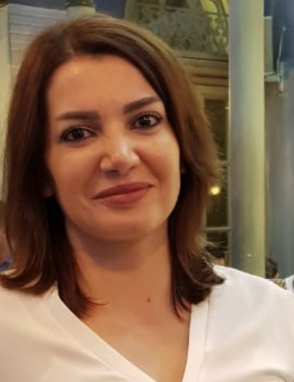

```{r setup, include=FALSE}
knitr::opts_chunk$set(echo = TRUE, fig.align = 'center', fig.width = '40%')
```

## A Little About Me.
#### From: 
Grew up in **Beirut, Lebanon;** Moved to USA (Texas) in 1999, then moved back to Lebanon in 2007, and now back to Portland since September 2020 after surviving the devastating Beirut explosion that took place in August 2020.



#### Working Life:
I worked 5 years as a software engineer with Sony, Nortel Networks and Sprint; 13 years as a Senior Services and Technologies Expert with the Telecommunications Regulatory Authority in Lebanon. I am currently working at the Multnomah County Health Department as a Senior Procurement Analyst.

#### Languages: 

Language | Proficiency
-------- | -----------
English  | Full professional
Arabic   | Native <br> Bilingual
French   | Beginner

#### Education Background and Professional Memberships:
- **BS in Computer Science** from the American University of Beirut.
- **MBA (Operations and Technology Management concentration)** from University of Portland (graduated in August 2022).
- I am currently working on receiving a **Post-graduate certificate in Business Analytics** from the University of Portland, to be completed in Spring 2023. 
- I am a member of Beta Gamma Sigma (BGS), the international business honor society for the highest performing students
from the top 5% of business schools, worldwide (those with AACSB accreditation).

#### Professional Goals:
A managerial position in the Operations & Technology Management field.

#### Personal Goals: 
- *Learning 2 new languages.*
- *Taking my boys on a trip to Europe.*

#### Interesting Fact About Me: 
I love traveling and learning about new cultures. So far, I’ve been to **24 countries.**   

#### Skills:
- *Project Management*
- *System Analysis*
- *Tableau Software*
- *SQL*
- *Financial Analysis*
- *Business Process Development and Improvement*
- *Managerial Accounting and Reporting*
- *Cross-Functional Collaboration*

#### A Website I visit a Lot
Following is a link to a website I visit regularly to read business-related articles:
[Harvard Business Review](https://hbr.org/)


## What I am hoping to learn from this Course.
I am looking forward to building a high level of understanding of the R programming language. Of special interest to me is using R in data analytics and in generating various visualizations to help make data-informed decisions, as well as in data cleaning and manipulation. 

