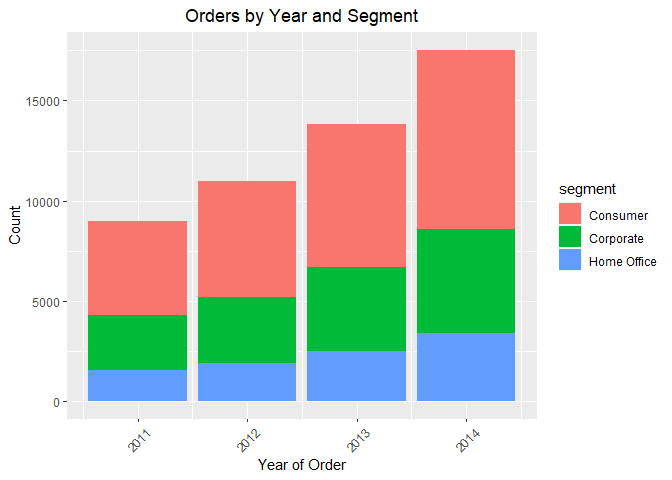
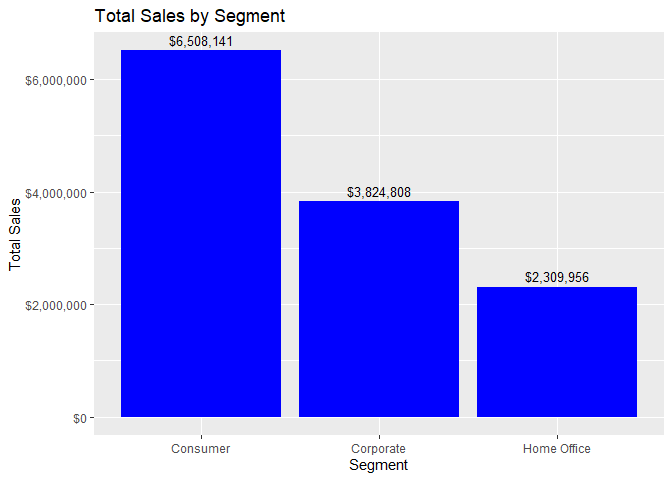
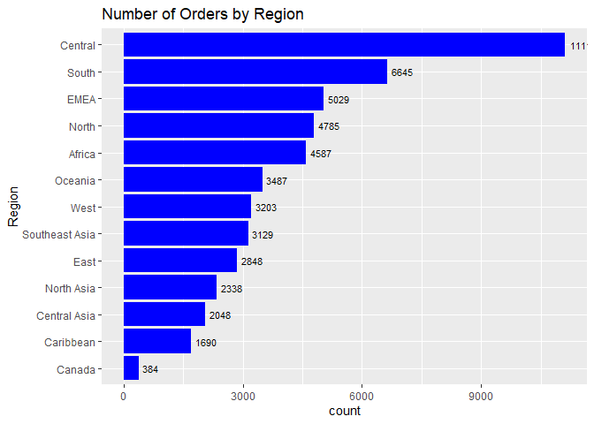
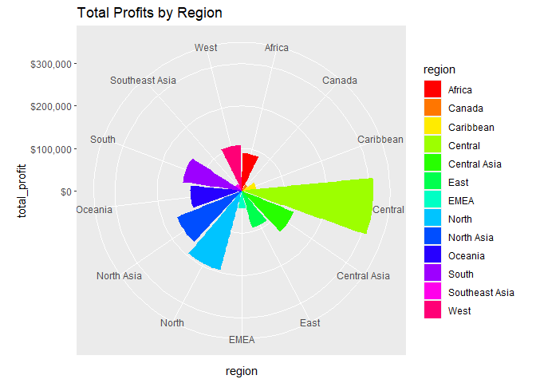
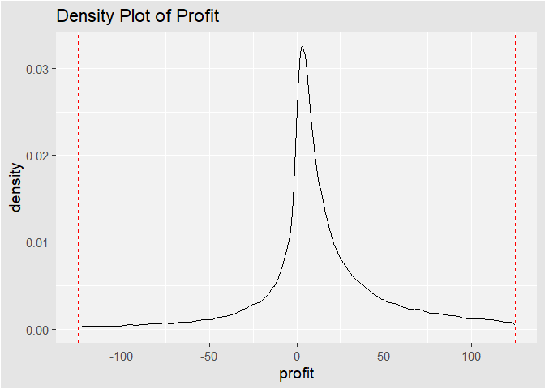

Saifeddine_Assignmene_02
================
Soha Saifeddine
2023-02-14

## Reading the CSV file data into an R data frame/tibble

``` r
library(readr)
file_location <- paste0(getwd(), "/Project02_SuperStoreOrders.csv")
orders_data <- read_csv(file_location)
```

    ## Rows: 51290 Columns: 21
    ## ── Column specification ────────────────────────────────────────────────────────
    ## Delimiter: ","
    ## chr (15): order_id, order_date, ship_date, ship_mode, customer_name, segment...
    ## dbl  (5): quantity, discount, profit, shipping_cost, year
    ## num  (1): sales
    ## 
    ## ℹ Use `spec()` to retrieve the full column specification for this data.
    ## ℹ Specify the column types or set `show_col_types = FALSE` to quiet this message.

## Question 1

Creating a summary statistic:

``` r
summary(orders_data)
```

    ##    order_id          order_date         ship_date          ship_mode        
    ##  Length:51290       Length:51290       Length:51290       Length:51290      
    ##  Class :character   Class :character   Class :character   Class :character  
    ##  Mode  :character   Mode  :character   Mode  :character   Mode  :character  
    ##                                                                             
    ##                                                                             
    ##                                                                             
    ##  customer_name        segment             state             country         
    ##  Length:51290       Length:51290       Length:51290       Length:51290      
    ##  Class :character   Class :character   Class :character   Class :character  
    ##  Mode  :character   Mode  :character   Mode  :character   Mode  :character  
    ##                                                                             
    ##                                                                             
    ##                                                                             
    ##     market             region           product_id          category        
    ##  Length:51290       Length:51290       Length:51290       Length:51290      
    ##  Class :character   Class :character   Class :character   Class :character  
    ##  Mode  :character   Mode  :character   Mode  :character   Mode  :character  
    ##                                                                             
    ##                                                                             
    ##                                                                             
    ##  sub_category       product_name           sales            quantity     
    ##  Length:51290       Length:51290       Min.   :    0.0   Min.   : 1.000  
    ##  Class :character   Class :character   1st Qu.:   31.0   1st Qu.: 2.000  
    ##  Mode  :character   Mode  :character   Median :   85.0   Median : 3.000  
    ##                                        Mean   :  246.5   Mean   : 3.477  
    ##                                        3rd Qu.:  251.0   3rd Qu.: 5.000  
    ##                                        Max.   :22638.0   Max.   :14.000  
    ##     discount          profit         shipping_cost    order_priority    
    ##  Min.   :0.0000   Min.   :-6599.98   Min.   :  0.00   Length:51290      
    ##  1st Qu.:0.0000   1st Qu.:    0.00   1st Qu.:  2.61   Class :character  
    ##  Median :0.0000   Median :    9.24   Median :  7.79   Mode  :character  
    ##  Mean   :0.1429   Mean   :   28.64   Mean   : 26.38                     
    ##  3rd Qu.:0.2000   3rd Qu.:   36.81   3rd Qu.: 24.45                     
    ##  Max.   :0.8500   Max.   : 8399.98   Max.   :933.57                     
    ##       year     
    ##  Min.   :2011  
    ##  1st Qu.:2012  
    ##  Median :2013  
    ##  Mean   :2013  
    ##  3rd Qu.:2014  
    ##  Max.   :2014

Note that the `echo = FALSE` parameter was added to the code chunk to
prevent printing of the R code that generated the plot.

Here are some observations/analysis based on the summary statistics:

- The data set provided represents information on orders made by
  customers, with a total of 51,290 orders. The orders were made between
  the years 2011 and 2014 and are distributed across various regions,
  markets, and product categories.
- The data set contains various features of the orders, such as
  order_id, order_date, ship_date, ship_mode, customer_name, segment,
  state, country, product_id, category, sub_category, product_name,
  sales, quantity, discount, profit, shipping_cost, order_priority, and
  year.
- The sales range from 0 to 22,638, with an average of 246.5, and a
  median of 85.0. The average profit is 28.64, with a minimum of
  -6599.98 and a maximum of 8399.98. The average shipping cost is 26.38,
  with a minimum of 0.00 and a maximum of 933.57.
- The data shows that the majority of the orders were shipped with a low
  shipping cost (with a mean of 26.38), and with a small discount (with
  a mean of 0.14). The year variable ranges from 2011 to 2014, with the
  majority of orders (first quartile and median) being placed in 2012 or
  later.
- Further analysis of the data could provide insights into the customer
  segments, product categories, and regions that generate the most sales
  or profit. It could also help identify any trends or patterns in
  customer behavior, such as which products are most frequently ordered
  together, and at what times of the year customers tend to make the
  most purchases.

## Question 2

Analyzing how the orders are made over the years and by segments:

``` r
# Load required library
library(ggplot2)

# Plot the bar graph
ggplot(orders_data, aes(x = year, fill = segment)) +
  geom_bar() +
  labs(title = "Orders by Year and Segment", x = "Year of Order", y = "Count") +
  theme(plot.title = element_text(hjust = 0.5),
        axis.text.x = element_text(angle = 45, vjust = 0.5))
```

<!-- -->

Observations: The bar graph shows how many orders were made over the
years and by segments. Each bar in the graph represents a year, and the
height of the bar shows the total number of orders made in that year.
The bars are further divided into segments, each representing a
different customer segment. By examining the graph, we can see how the
orders were made over the years 2011, 2012, 2013, and 2014 and by
segments. We can identify the years with the most orders and the
customer segments that contributed the most to the orders. We can also
observe any trends or patterns in the data over time and by segment. We
notice here that there is an increasing trend in orders in all segments;
with the most orders in 2014 and the least in 2011.

## Question 3

To determine which segment is the best seller in the entire data set, we
can group the data by segment and calculate the total sales for each
segment, and then compare them. We can then create a bar plot to
visualize the sales of each segment and confirm the best seller.

``` r
library(ggplot2)
library(scales)
```

    ## 
    ## Attaching package: 'scales'

    ## The following object is masked from 'package:readr':
    ## 
    ##     col_factor

``` r
# Calculate total sales for each segment
sales_by_segment <- aggregate(sales ~ segment, data = orders_data, sum)

# Order segments by total sales in descending order
sales_by_segment <- sales_by_segment[order(sales_by_segment$sales, decreasing = TRUE),]
print(sales_by_segment)
```

    ##       segment   sales
    ## 1    Consumer 6508141
    ## 2   Corporate 3824808
    ## 3 Home Office 2309956

``` r
# Create bar plot of sales by segment
ggplot(sales_by_segment, aes(x = segment, y = sales)) +
  geom_bar(stat = "identity", fill = "blue") +
  geom_text(aes(label = dollar(sales)), vjust = -0.5, size = 3.5) +
  xlab("Segment") +
  ylab("Total Sales") +
  ggtitle("Total Sales by Segment") +
  scale_y_continuous(labels = dollar) +
  scale_x_discrete(limits = sales_by_segment$segment)
```

<!-- -->

The Consumer segment is the best seller in the entire data set (with
total sales of \$6,508,141), followed by the Corporate segment with a
total sales of \$3,824,808. The segment with the least sales is the Home
Office segment with total sales of \$2,309,956.

## Question 4

Bar chart of regional orders:

``` r
library(dplyr) # Load dplyr for data manipulation
```

    ## 
    ## Attaching package: 'dplyr'

    ## The following objects are masked from 'package:stats':
    ## 
    ##     filter, lag

    ## The following objects are masked from 'package:base':
    ## 
    ##     intersect, setdiff, setequal, union

``` r
library(ggplot2) # Load ggplot2 for data visualization

# Group the orders data by region and count the number of orders in each region
orders_per_region <- orders_data %>%
  group_by(region) %>%
  summarize(num_orders = n())

# Create a bar plot of the number of orders by region
ggplot(orders_per_region, aes(x = reorder(region, num_orders), y = num_orders, fill = "blue")) +
  geom_bar(stat = "identity") + # Add bars with heights equal to the number of orders
  geom_text(aes(label = num_orders), hjust = -0.2, color = "black", size = 3) + # Add text labels with the number of orders
  xlab("Region") + # Add x-axis label
  ylab("count") + # Add y-axis label
  ggtitle("Number of Orders by Region") + # Add plot title
  scale_fill_identity(name = "Color", guide = "none") + # Set fill color to blue
  coord_flip() # Flip the x and y axes to create a horizontal bar chart
```

<!-- -->

Analysis: Based on the bar chart, the Central region receives the most
orders, with a total of over 11,000 orders, while the Canada region
receives the fewest orders, with a total of only 384 orders. This is
further validated by the length of the bars in the plot, where the
longer bars correspond to higher order numbers. Overall, it appears that
the Central region is the most popular for orders, followed by the South
and EMEA regions, while the Canada region has the fewest orders.

## Question 5

Creating the profits graph by region:

``` r
library(dplyr)   # Load the dplyr package for data manipulation
library(ggplot2) # Load the ggplot2 package for data visualization

orders_data %>% 
  mutate(total_profit = sum(profit)) %>% # Add a new column for the total profit earned in each order
  group_by(region) %>%                  # Group the data by region
  summarize(total_profit = sum(profit)) %>% # Calculate the total profit earned by region
  
  ggplot() +                            # Create a new ggplot object
  geom_bar(aes(x = region, y = total_profit, fill = region), stat = "identity") + # Create a bar plot with the x-axis showing region and the y-axis showing total_profit. Fill the bars with colors based on the regions
  coord_polar(theta = "x") +            # Set the coordinate system to polar
  scale_fill_manual(values = rainbow(length(unique(orders_data$region)))) + # Set the color palette for the fill using a rainbow palette
  ggtitle("Total Profits by Region") +  # Set the title of the plot
  labs(x = "region", y = "total_profit") +  # Label the x-axis and y-axis
  scale_y_continuous(labels = scales::dollar_format(prefix = "$", suffix = "")) # Display the y-axis labels dollar values with prefix $ 
```

<!-- -->

## Question 6

Density plot to infer the total profit made:

``` r
library(dplyr) # Load the dplyr package for data manipulation
library(ggplot2) # Load the ggplot2 package for data visualization

# Subset the orders_data by filtering the orders with profits in the range [-125, 125]
orders_subset <- orders_data %>% filter(profit >= -125 & profit <= 125)

# Create density plot
ggplot(orders_subset, aes(x = profit)) +
  geom_density(color = "black", fill = NA, alpha = 0.5) + # # Add the density plot layer with black color line and no fill with 0.5 transparency
  geom_vline(xintercept = c(-125, 125), linetype = "dashed", color = "red") + # # Add two dashed vertical lines at the profit values -125 and 125 with red color
  xlab("profit") + # Set the x-axis label as "profit"
  ylab("density") + #  # Set the y-axis label as "density"
  ggtitle("Density Plot of Profit") + # Set the plot title
  #scale_x_continuous(labels = scales::dollar) + # Scale the x-axis labels as dollars using the scales::dollar function
  theme_gray(base_size = 14) + # Set the base font size of the plot to 14
  theme(plot.background = element_rect(fill = "grey90"), # Set the plot background color as grey90
        panel.background = element_rect(fill = "grey95"), # Set the panel background color as grey95
        panel.grid.major = element_line(color = "white"), # Set the major grid lines color as white
        panel.grid.minor = element_line(color = "white"))  # Set the minor grid lines color as white
```

<!-- -->

Interpretation: The density plot of profit shows the distribution of
profit values for orders in the range of \[-125, 125\]. The density plot
is useful for identifying the shape of the distribution and the central
tendency of the data. From the plot, we can see that the distribution of
profit values is roughly symmetrical, with a peak around zero profit.
This suggests that the majority of orders in this range generated a
small profit or no profit. There are relatively fewer orders that
generated a high profit or a high loss. The dashed red lines indicate
the cutoff points for orders that generated a profit of more than \$125
or a loss of more than \$125. The plot shows that the highest
concentration of profits is in the range of approximately -\$25 to \$50,
with a peak at around \$0. This means that the most common profit amount
for these orders is very close to \$0, which could indicate that the
store is either breaking even or making a very small profit on these
orders. Overall, the density plot indicates that the profits made by the
store are generally low and are concentrated in a narrow range. However,
there are some orders with higher profits, which may warrant further
investigation to identify what factors contribute to their success.

## Honors Pledge:

As a student of the Dr. Robert B. Pamplin Jr. School of Business I have
read and strive to uphold the University’s Code of Academic Integrity
and promote ethical behavior. In doing so, I pledge on my honor that I
have not given, received, or used any unauthorized materials or
assistance on this examination or assignment. I further pledge that I
have not engaged in cheating, forgery, or plagiarism and I have cited
all appropriate sources. Student Signature: Soha Saifeddine
